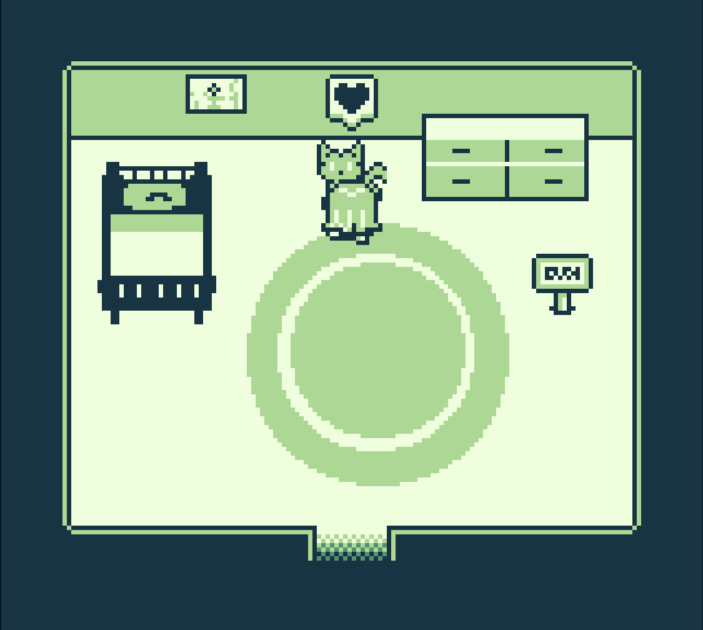
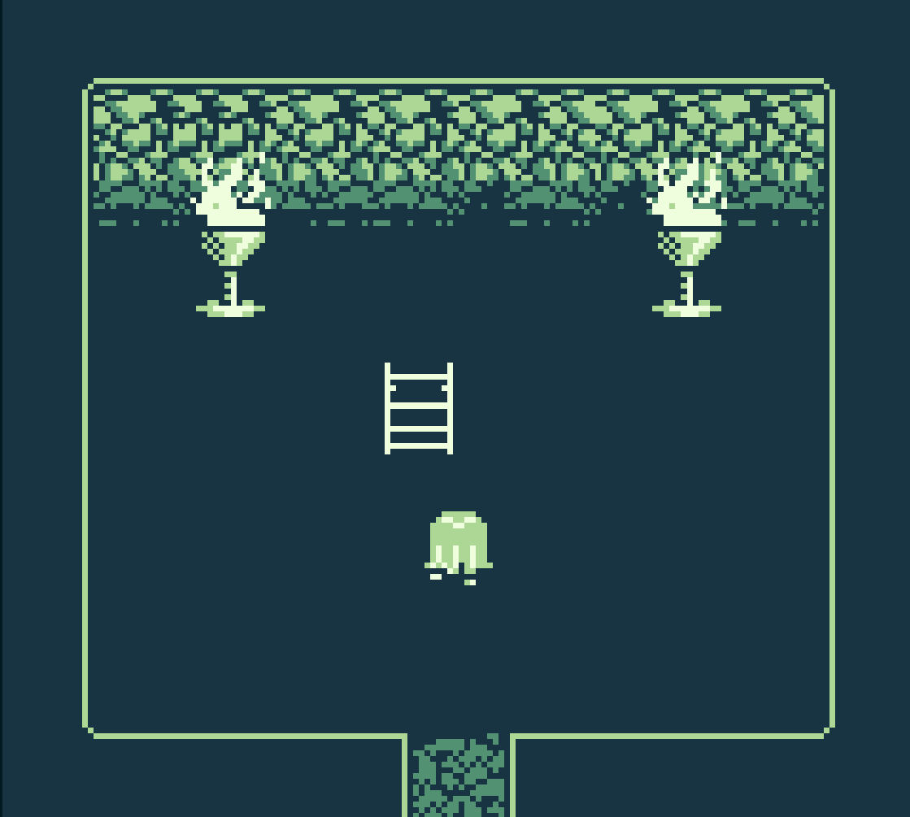
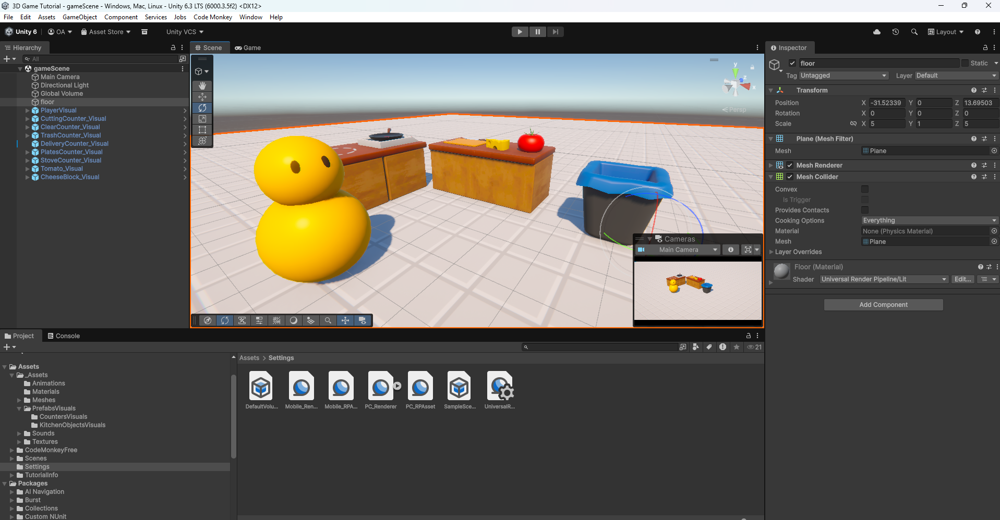
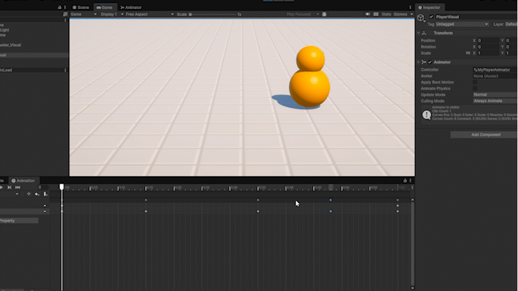
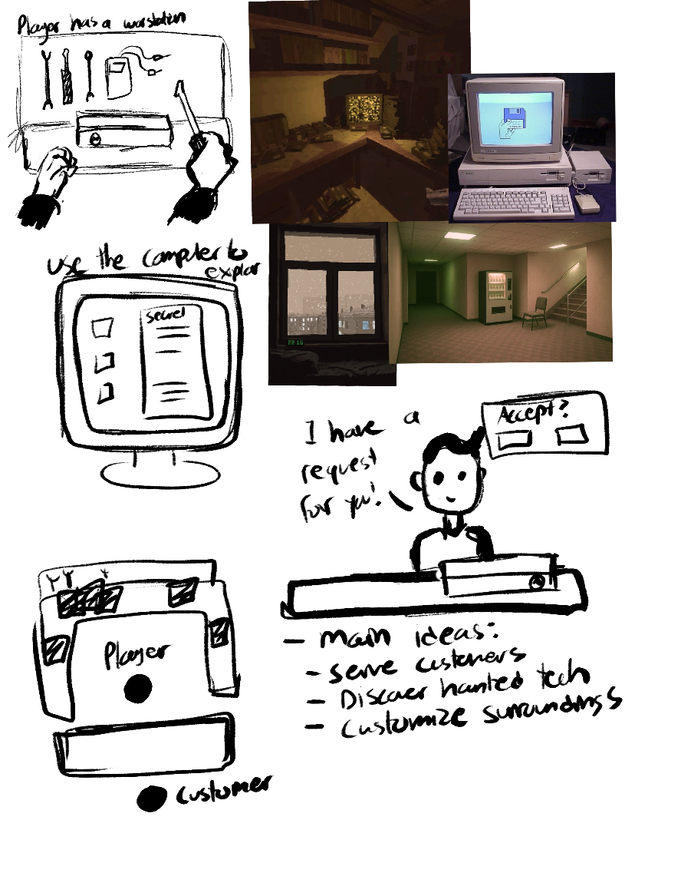

# Olivia Axiuk Game Prototyping Journal CART 315

## Make a Thing | Due 2026-01-21

### Intro

For this week, our task was simply to “make a thing” using the provided
beginner-friendly game engine tools to make a limited-scope project. Due to my current interest
in retro consoles, the possibility of making a GameBoy compatible game with GameBoy Studio
was very appealing. As well, the promise of a beginner-friendly “drag and drop” style engine
piqued my interest. Although I have created small game-like applications in the past using
mainly JavaScript, I liked that GameBoy Studio provided the opportunity for quick
experimentation while providing ready-made and easily editable assets to jumpstart the process.

### Positive Thoughts

To begin creating this project, I explored the template game given by GameBoy studio,
studying the way that the player interacted with objects and characters, opening the code and
getting to know the program. I decided that my idea would be a quaint game where the player
explores a small town, helping with everyday tasks given by the NPCs. Having some prior
coding knowledge, I found the interface of GameBoy studio especially easy to use, simplifying
coding terms and often-used functions into simple drop-down menus. At the beginning of the
process, I found the experience overall pleasant, easy to use and encouraging for someone
relatively new to gamemaking.

### Issues

However, one glaring issue severely slowed down my process and, unfortunately,
negatively affected my enjoyment of the GameBoy Studio process. A strange issue arose that
affected the program’s ability to compile the game. It became very frustrating when I would
make changes to my game, but find myself unable to see them applied. The problem seems to be
a common one with GameBoy studio, which does, as of now, not have a solution. I had to find
workarounds for the glitch, but every solution would only work for a short amount of time before
my game would stop compiling again. As a result, many hours I would have spent working on
the actual gameplay were instead allocated to fixing this problem, and the scope of my game was
greatly minimized.

### Finally

Of course, not all was in vain. I found that bringing in the provided assets into Photoshop,
where I edited them to suit my game better, provided an opportunity to study and modify
game-ready pixel art. As well, the experience was also a lesson in planning and anticipating for
glitches and setbacks, something inevitable during the game making process. Overall, the “Make
a Thing” project still introduced me to a new way of making games, and the program was fun
enough to use that I would be willing to give it a second chance.

## Journal 02 | Due 2026-01-29

## Trouble getting started

For my first design journal, I intended to follow a tutorial based on player movement, colliders, and other basic game functions as we did not get to these topics during the class session. However, I unfortunately ran into many technical issues which hindered by ability to complete the tutorial. In a way, my situation is very in-line with my first design journal, as I did not anticipate to have issues installing Unity on my device. Hopefully I will have the installation working soon, however, it is nonetheless another early lesson in planning to allocate time for these types of setbacks.

## Plans Moving Forward

Of course, my main priority at this moment is to get Unity working on my computer. I still plan on following the tutorial that I have chosen once this is done. The end result should be a simple 2D "catch-all" game, complete with a Game Over screen, an amount of time played, and custom sprites. Although I have chosen this tutorial due to its ability to teach basic technical aspects, I would like to use this knowledge to expand into a game genre that I am more interested in, which is the RPG. I can see how the implementation of sprites, colliders and point systems can easily translate over into other game genres, and I would like to slowly build around the 2D format in order to create a story-driven, immersive experience. 

## Setting Goals

For next week, I would like to have finally ironed out my major technical issues and have started building some sort of base for a project I care about. There are a few projects which come to mind in terms of ideas I'd like to bring to life, and the possibility of expanding on them is very exciting. I will begin by having the scaffolding of a project for next week before mapping out fully fleshed out ideas. There needs to be sand in the sandbox before a castle can be built!

The tutorial I aimed to follow: https://youtu.be/xx1oKVTU_gM?si=0jEpK0FzO9lbCpPR

## Journal 03 | Due 2026-02-05

## Finally some fun in Unity!

This week, I was finally able to follow a tutorial in Unity without any technical difficulties. I am pleased with the fact that I was able to explore Unity's different editing capabilities, such as the animation editor and post processing as well beginning to code some basics, like player movement. Not only was I able to recall and apply the basics taught in class, but the tutorial also emphasized some best practices when it comes to keeping code and Unity projects clean; such as always parenting player visuals to an empty object, keeping visuals and logic separate. It was also satisfying to use the pre-made assets and to play around with post processing effects, creating something that actually looked like the beginnings to a game. 

The tutorial itself is around 10 hours long, and so far I've only gotten around 2 hours in or so, but it definitely seems like a very valuable resource to continue to study and to go back to, especially regarding 3D game-making. Speaking of which, I am leaning towards making a 3D style game as I continue forward. 

## Grand Ideas

For my game concept that I would like to develop into a working prototype, I've been thinking of creating something that lies between a cozy game and a low-poly style horror game. The main idea is that the player takes the role of a tech-repair person, fixing customer's TVs, consoles, etc. However, they would soon realize that strange things begin happening around the shop, due to some of these devices being haunted. Through these pieces of technology, the player will be able to find out more about the customers and their devices. As well, each successful 'repair' would in return give the player money to upgrade not only their tools, but also the aesthetics of their shop.

My main prioritized with this project as I flesh it out are:
- To decide which mechanics are most meaningful to the game
- to set realistic goals for development
- to develop a clearer idea of basic player mechanics

My secondary priorities would be:
- To develop the visual style
- To strategize how to balance the "cozy" and nostalgic elements with the horror ones.

I know that making the entire game within a few weeks would be near impossible, so I want to keep my goals concrete and realistic. I would like to have a short, working demo by the end of the semester which shows basic functionality and basic visuals to get the gameplay feeling across. In other words, I'd like to have a working base that I could build off of in the future.

Here is a small moodboard and some quick sketches I made while brainstorming

Followed tutorial: https://www.youtube.com/watch?v=AmGSEH7QcDg&t=5376s

## Journal 03 | Due 2026-02-12

## Setting Goals for the week

My main goals for this week are:
- Set up a Unity project, get basic movement and interaction system done or in progress (this can include player and NPC interaction)
- Using premade assets, set up a basic environment to begin exploring potential player experience.